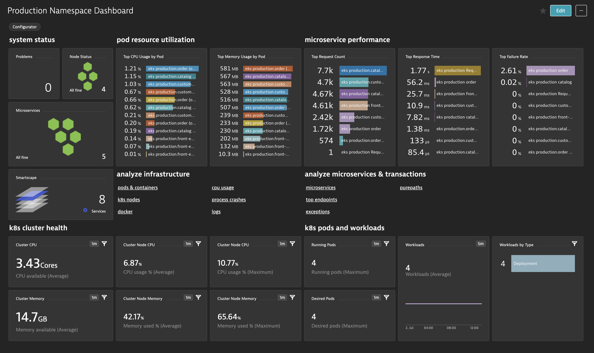

## Summary:
This repo is a collection of JSON files designed for automating the monitoring of Kubernetes in Dynatrace, with the BizOpsConfigurator.

## Contents:
* managementZone_kubernetes-namespace.json - Template for configuring a Management Zone for each Kubernetes Namespace
* managementZone_kubernetes-cluster.json - Template for configuring a Management Zone for the entire Kubernetes Cluster
* taggingRule_kubernetes-namespace.json - Creates a tagging rule for 1 tag with a value for each Kubernetes Namespace
* taggingRule_kubernetes-pod.json - Creates a tagging rule for 1 tag with a value for each Kubernetes Base Pod
* dashboard_kubernetes-namespace.json - Creates a dashboard template for viewing a Kubernetes Namespace

## Variables:
### managementZone_kubernetes-namespace.json:
* managementZone_id -> unique 64 bit identifier of management zone
* managementZone_name -> unique name of management zone
* kubernetes_cluster-name -> name of kubernetes cluster as configured in Dynatrace
* kubernetes_cloud-type -> cloud type for kubernetes cluster nodes (EC2,Azure,Oracle,OpenStack,Google Cloud Platform)
* kubernetes_namespace -> kubernetes namespace for management zone

### managementZone_kubernetes-cluster.json:
* managementZone_id -> unique 64 bit identifier of management zone
* managementZone_name -> unique name of management zone
* kubernetes_cluster-name -> name of kubernetes cluster as configured in Dynatrace
* kubernetes_cloud-type -> cloud type for kubernetes cluster nodes (EC2,Azure,Oracle,OpenStack,Google Cloud Platform)

### taggingRule_kubernetes-namespace.json:
* taggingRule_id -> unique UUID of automatic tag
* taggingRule_name -> unique name of automatic tag
* kubernetes_cluster-name -> name of kubernetes cluster as configured in Dynatrace
* kubernetes_cloud-type -> cloud type for kubernetes cluster nodes (EC2,Azure,Oracle,OpenStack,Google Cloud Platform)

### taggingRule_kubernetes-pod.json:
* taggingRule_id -> unique UUID of automatic tag
* taggingRule_name -> unique name of automatic tag
* kubernetes_cluster-name -> name of kubernetes cluster as configured in Dynatrace
* kubernetes_cloud-type -> cloud type for kubernetes cluster nodes (EC2,Azure,Oracle,OpenStack,Google Cloud Platform)

### dashboard_kubernetes-namespace.json
* dashboard_name -> name to apply to the dashboard
* managementZone_id -> unique 64 bit identifier of management zone that will be set as the default when dashboard is opened
* managementZone_name -> unique name of management zone that will be set as the default when dashboard is opened
